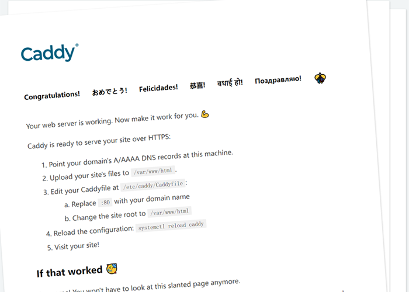

## 前言

Caddy服务器（或称 Caddy Web）是一个开源的，使用 Golang 编写，支持 HTTP/2 的 Web 服务端，它使用 Golang 标准库提供 HTTP 功能。Caddy 一个显著的特性是默认启用 HTTPS，它是第一个无需额外配置即可提供 HTTPS 特性的 Web 服务器。Caddy 可以提供各种网站技术，它也可以作为反向代理和负载均衡器。Caddy 的大部分功能都以中间件的形式实现，并通过 Caddyfile 中的指令（用于配置 Caddy 的文本文件）进行控制。

<!--more-->

> 简单来说就是开箱即用

- [Caddy 官网](https://caddyserver.com)

---

## 安装
打开 **Caddy** 官网，点击下载源文件，或者按照官方教程中的安装方式进行安装，我服务器是 **Debian**，就使用命令行进行安装：

```bash
apt install -y debian-keyring debian-archive-keyring apt-transport-https
curl -1sLf 'https://dl.cloudsmith.io/public/caddy/stable/gpg.key' | gpg --dearmor -o /usr/share/keyrings/caddy-stable-archive-keyring.gpg
curl -1sLf 'https://dl.cloudsmith.io/public/caddy/stable/debian.deb.txt' | tee /etc/apt/sources.list.d/caddy-stable.list
apt update
apt install caddy
```

安装完成后可输入 `caddy version` 或者 `which caddy` 看是否安装成功。

**注意**：这里默认安装的是 Caddy2 

---

## 配置

安装完成后在浏览器输入服务器 IP 就可以看到 Caddy 已经开始运行了，并且生成了一个默认页面：



这个时候我们创建好网站目录：

```bash
mkdir -p /var/www/xx
```

然后我们可以对 Caddy 进行配置了，用 `vim` 命令对配置文件进行编辑，拿不准的可以下载下来编辑文件路径为 **/etc/caddy/Caddyfile** 

```bash
vim /etc/caddy/Caddyfile
```

Caddy 的配置比较简单，第一行输入绑定好的域名，这样就会自动开启80和443端口：

```caddyfile
xx.com
```

然后是网站根目录设置：

```caddyfile
xx.com {
    root * /var/www/xx
}
```

这样一个简单的站点就已经配置完成了，然后添加一些自己需要的功能，并且开启静态文件浏览：

```caddyfile
xx.com {
    root * /var/www/xx
    encode gzip
    file_server
    tls XX@email.com
}
```

如果要开设多个站点，那么直接另起一行，进行其他站点的配置就行了：

```caddyfile
xx.com {
    root * /var/www/xx
    encode gzip
    file_server
    tls XX@email.com
}
www.xx.com {
    root * /var/www/yy
    tls xx@email.com
}
```

或者将子域名重定向到主域名：

```caddyfile
xx.com {
    root * /var/www/xx
    encode gzip
    file_server
    tls XX@email.com
}
www.xx.com {
    redir https://xx.com{uri}
}
```

我的设置参考：

```caddyfile
# 域名
domain.com {
    # 设置日志文件位置，等级为 error
    log {
        output file /var/log/caddy/xx.log
        level error
    }
    # 网站根目录
    root * /var/www/xx
    # 开启 gzip
    encode gzip
    # 错误页面
    handle_errors {
        rewrite * /{err.status_code}.html
        file_server
    }
    # PHP
    php_fastcgi unix//run/php/php7-fpm.sock
    # 静态文件服务
    file_server
    # TLS设置
    tls xx@email.com
}
```

配置完成后输入以下命令检查配置：

```bash
caddy adapt --config /etc/caddy/Caddyfile
```

如未报错，则表示配置无误。

重载 Caddy 配置：

```bash
caddy reload --config /etc/caddy/Caddyfile
```

重启 Caddy 并添加自启动

```bash
systemctl restart caddy
systemctl enable caddy
```

一些基本的 Caddy 配置就是这么多了，详细内容可以到官方文档进行查阅：[Caddy 官方文档](https://caddyserver.com/docs/)

---

## 上传文件

最后我们将自己的静态文件页面上传至 **/var/www/xxx** 也就是你的网站根目录下即可进行访问啦！
