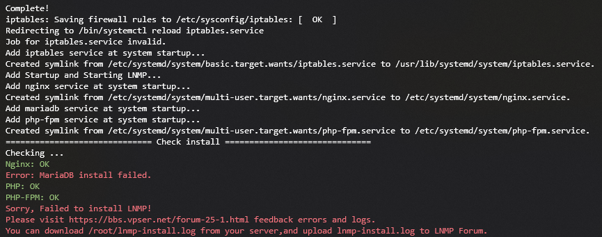
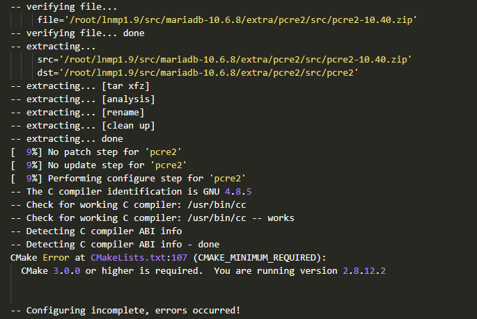
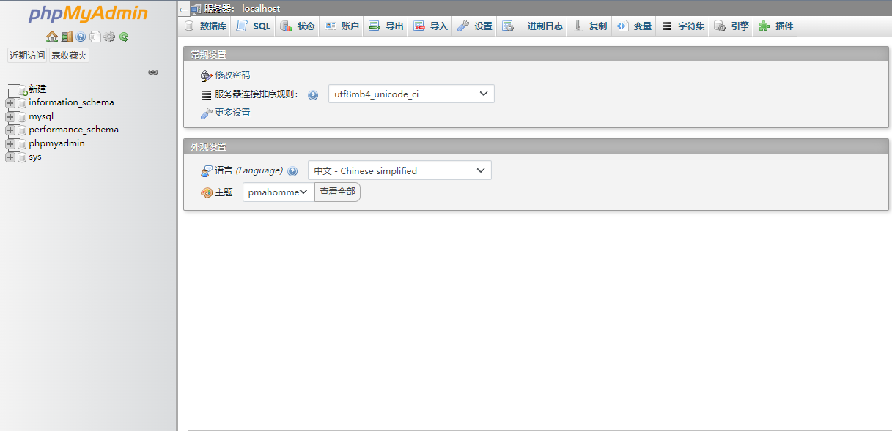

## 前言

由于最近腾讯云双11优惠活动，自己购买了一台腾讯云的轻量应用服务器 (老实说还是挺实惠的-。-) 加上自己按捺不住折腾的心，这次一改以前一直使用的 Debian 而选择了 CentOS ；这次的服务器系统我选择的是 CentOS7 ，LNMP 安装方式则是 Oneinstack 和 LNMP 一键安装包都进行了尝试。Debian 下，它们都是完美安装。但是 Centos7 下，在安装过程中 Oneinstack 和 LNMP 一键安装包都碰到了 MariaDB/MySQL 无法安装的情况，由于我是一个 Linux 小白，平常只靠从网上学习，知识量不足；所以在此记录下这次解决过程，以便日后进行查阅。

<!--more-->

---

## 解决过程

### 报错

和往常一样，服务器开通后，我通过 `yum` 进行了一些基本的 `update` 、`autoremove` 、`clean` 等操作，然后创建 Screen 窗口，输入 LNMP 一键包命令就开始安装了，到最后却发现 **MariaDB** 安装失败；一开始也不知道啥情况，以为是我选的源码编译方式有问题，后面试了二进制安装依然如此：



### 尝试

后面我在网上查了很久，他们说是 Centos 自带了 RPM 包下的 MariaDB ；新安装会有冲突，所以要进行卸载，于是我通过 rpm 命令进行卸载：

> 顺带一提，这搜索体验真的是。。。不能说是差强人意吧，也只能说是一言难尽了。。。

```bash
rpm -qa|grep mariadb
rpm -e mariadb-lib
```

发现存在依赖关系，于是加上 `nodeps` 参数：

```bash
rpm -e --nodeps mariadb-lib
```

接着满怀期待的又进行安装，最后还是报错-。-

### 错误日志

还是硬着头皮来看错误日志吧，我将 **/root/lnmp-install.log** 安装日志下载下来进行查看。虽然说很长，咱也看不太懂。。。最后还是找到了一些破绽。。。发现应该是 **Cmake** 版本低了：



可以看到，这里要求 **3.0.0** 版本或者更高，而我的版本为 **2.8.12.2** ，于是我返回 SSH 使用 `yum update cmake` 更新之后发现还是 **2.8.12.2** 版本，于是选择下载最新版本进行编译。

### 下载编译 Cmake

打开 [版本下载列表](https://cmake.org/files/LatestRelease/Cmake) 找到最新版本，我这里目前最新版是 **3.24.3** ，然后复制链接，回到 SSH 

```bash
# 卸载Cmake
yum remove -y cmake
# 创建文件夹
mkdir /opt/cmake
# 进入目录
cd /opt/cmake
# 下载压缩包
wget https://cmake.org/files/LatestRelease/cmake-3.24.3.tar.gz
# 解压
tar -zxvf cmake-3.24.3.tar.gz
# 安装依赖
yum install -y gcc gcc-c++ openssl-devel
# 进入目录
cd cmake-3.24.3
# 设置编译目录
./configure --prefix=/usr/local/cmake
# 安装
make && make install
# 创建链接
ln -s /usr/local/cmake/bin/cmake /usr/bin/cmake
# 查看版本
cmake -version
```

### 重新安装数据库

一通操作下来，Cmake 已经是最新版本了，然后进入到 **~/lnmp1.9** 也就是 LNMP 一键包解压目录下进行操作：

```bash
./install.sh db
```

然后选择需要安装的数据库及版本，接下来等待安装完成：


OK 打开浏览器输入 IP 地址进行访问，还是熟悉的默认页面：


然后点击 phpMyAdmin 登陆进去，OK 完美！



### 添加忽略（可选）

为防止误操作或运行自动化脚本情况导致被覆盖，可以将 cmake 添加忽略，编辑 `/etc/yum.conf` 

```bash
vim /etc/yum.conf
```

在末尾添加上：

```bash
exclude=cmake*
```

另外需要注意运行自动化脚本前查看一下是否会对配置文件进行编辑，若存在则需要修改脚本。

---

## 总结

以上就是我在使用 CentOS 安装 LNMP 环境时 MariaDB/MySQL 安装失败的情况，咱也不知道是个例还是就我这个小白这样。。。在此进行一个记录。希望能对大家有所帮助。最后顺带提一下，我咋就想到去折腾 CentOS 了；一直在用的Debian 它不香嘛。。。
