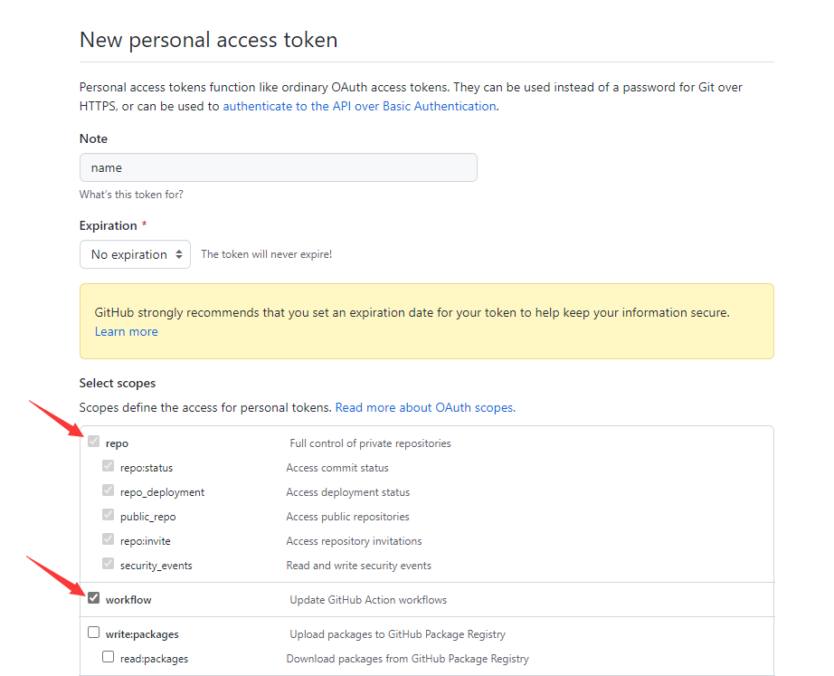
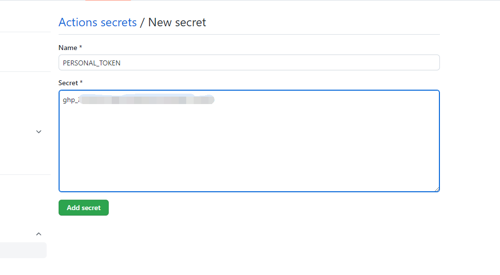
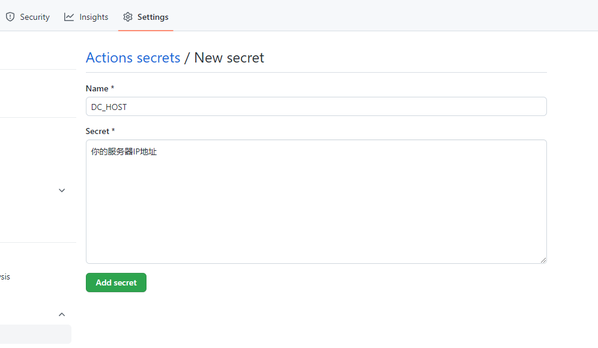
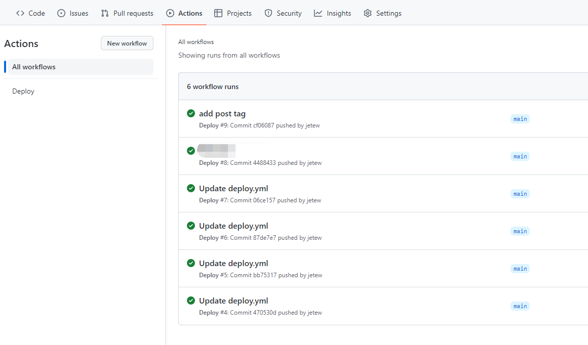
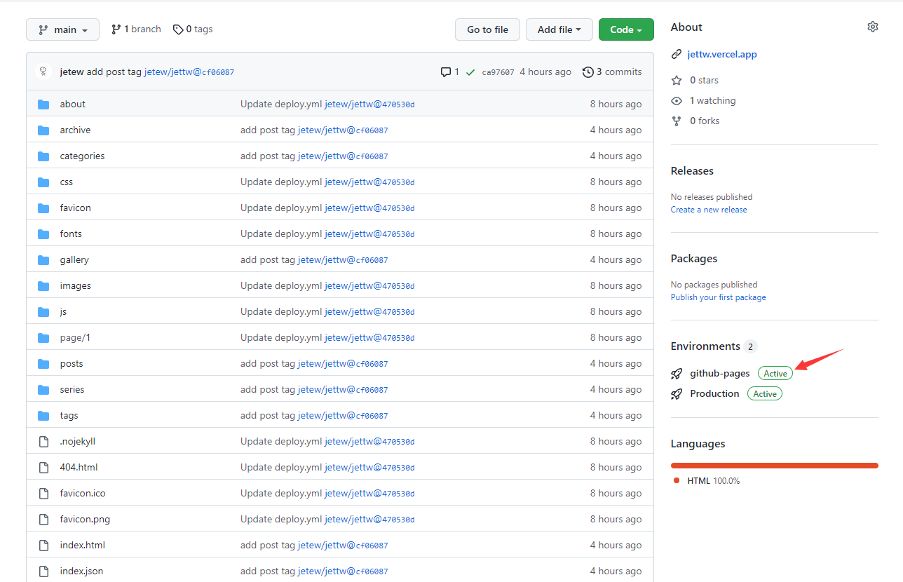

## 前言

之前在 [《使用 Hugo 搭建个人博客及部署》](/archives/hugo/) 一文中, 我讲了通过 Hugo 来搭建个人博客, 并部署到 Github Pages 来实现一个在线访问.但是这样手动部署一开始还觉得比较新奇有趣, 时间一长的话难免会觉得有些麻烦, 一有什么改动就要全部重新部署, 那么本文就将讲一下通过 `Github Actions` 来实现将我们的 Hugo 博客自动部署到 Github Pages 或者我们自己的云服务器上, 现在就一起来看一下.

**注意**: 本文所有操作的前提条件是在 [《使用 Hugo 搭建个人博客及部署》](/archives/hugo/) 一文的基础上, 可以先行查阅.

<!--more-->

---

## 介绍与准备

### Github Actions 是什么

GitHub Actions 是一种持续集成和持续交付 (CI/CD) 平台, 可用于自动执行生成、测试和部署管道.你可以创建工作流来构建和测试存储库的每个拉取请求, 或将合并的拉取请求部署到生产环境.
GitHub 提供 Linux、Windows 和 macOS 虚拟机来运行你的工作流程, 或者你可以在自己的数据中心或云基础架构中托管自己的自托管运行器. 

### 准备工作

以本文描述所说, 通过 Github 提供的 Actions 服务将 Hugo 博客自动部署到Github Pages 和云服务器, 那就需要以下准备: 

1. 存放 Hugo 博客项目的仓库, 该仓库拥有用于生成博客的 Markdown 文件, 生成静态博客的配置文件、主题等等; 也就是相当于我们本地博客的根目录, 该仓库可以设为私有.
2. 存放 Hugo 博客生成的静态文件仓库, 用于 Github Pages 进行访问; 仓库名为 `username.github.io` , 该仓库为开源.
3. 服务器或者虚拟主机, 是你自己购买的, 同样用于存放 Hugo 博客生成的静态文件.

下面一步步来进行操作.

---

## 配置 Github Actions

### 创建配置文件

首先, 在本地博客仓库根目录下, 创建 `.github/workflows/depoly.yaml` 文件名 depoly 随意, 这个就是 Github Actions 配置文件, 然后打开 VS Code 进行编辑; 复制下面的内容, 粘贴进去, 然后根据注释进行修改; 操作完成后删除注释并保存: 

```yaml
name: Deploy

on:
  push:
    branches:
      - main # 触发条件, 在 push 到 main 分支后
  workflow_dispatch: # 触发条件, 在 Github 仓库 Action 工具手动调用

jobs: # 任务
  build-and-deploy:
    runs-on: ubuntu-latest # 指定虚拟机环境为 Ubuntu 新版
    steps:
      - name: Checkout # 拉取代码
        uses: actions/checkout@v2 # 使用其他用户配置
        with:
          submodules: true # 包含子模块,也就是链接的主题
          fetch-depth: 0

      - name: Setup Hugo # 安装 Hugo
        uses: peaceiris/actions-hugo@v2 # 使用其他用户配置
        with:
          hugo-version: latest # Hugo 版本选择
          extended: true

      - name: Build Hugo # 生成博客静态文件
        run: hugo --minify

      - name: Deploy GhPages # 部署到 Github Pages
        uses: peaceiris/actions-gh-pages@v3 # 使用其他用户配置
        with:
          personal_token: ${{ secrets.PERSONAL_TOKEN }} # Personal Token
          external_repository: username/username.github.io # Github Pages 仓库名, username 换成你的
          publish_branch: main
          publish_dir: ./public
          commit_message: ${{ github.event.head_commit.message }}

      - name: Deploy To VPS # 部署到个人服务器
        uses: cross-the-world/scp-pipeline@master
        with:
          host: ${{ secrets.DC_HOST }} # Actions Secrets Token
          user: ${{ secrets.DC_USER }} # Actions Secrets Token
          pass: ${{ secrets.DC_PASS }} # Actions Secrets Token
          port: ${{ secrets.DC_PORT }} # Actions Secrets Token
          connect_timeout: 10s
          local: './public/*'
          remote: /var/www/html/ # 网站根目录
```
> 如果你不需要部署到个人服务器，可以将最后一个 `Action` (部署到个人服务器) 删除


人看麻了? 没关系, 我们只要明白少数几个地方即可, 我来慢慢梳理: 

- `on` 字段指定触发工作流的条件, 通常是某些事件, 如：

```yaml
on: push # 指定 push 事件可以触发
```

- `jobs`字段表示需要执行的任务

- `steps` 字段表示任务流程, 我们这个配置流程为: 

```yaml
steps: 
  - name: Setup Hugo
  - name: Build Hugo
  - name: Depoly GhPages
  - name: Depoly TO VPS
```

- `steps` 字段下的 `name` , `use` , `with` 加起来就是一个 Action

- `name` 表示一个 Action 的名称

- `use` 表示使用某个别人写好的插件

- `with` 表示传递给插件的参数

---

### 创建 Token

重点来了, 现在配置文件已经编辑好了, 我们需要创建相对应的 Token 来给 Actions 使用

#### Personal Token

打开 Github 点击 `右上角头像 - Settings - Developer setting - Personal access tokens - Generate new token` 创建一个 Token, 记得要勾选 `repo` 和 `workflow` 权限:  



生成后复制 Token **注意: Token 只会出现一次**


复制后打开存放 Hugo 博客的仓库, 点击 `Settings - Secrets - Actions - New repository secret` 输入刚才复制的 `Token` , 名字为 `PERSONAL_TOKEN`



如果你不需要将博客静态文件部署到个人服务器, 那么到这里就结束了. 下面来讲下部署到个人服务器的设置

#### Actions Secrets Token

在 Actions 配置文件中, 最后一个流程是部署到个人服务器, 那么这里有几个选项也是需要创建 Token 的, 分别为：

- `host` 你的服务器 IP 
- `user` 登陆用户名
- `pass` 登陆密码
- `port` SSH 端口，默认为 22, 如果修改了端口，或者供应商有指定端口，填入指定端口即可

以 `host` 为例, 在存放 Hugo 博客的仓库, 点击 `Settings - Secrets - Actions - New repository secret` 输入 Token Name 为 `DC_HOST` , Secret 为你的服务器 IP 地址, 对应配置文件中的 `${{ secrets.DC_HOST }}` 项



之后分别创建相对应的 Token ,然后修改最后一行 `remote` 网站根目录即可。

---
## 推送及更新

全部配置完成之后, 我们就可以将配置文件进行推送了, 将我们的本地博客仓库推送到创建好的私密仓库中: 

```bash
git init # 初始化仓库
git branch -M main # 设置分支为main
git add . # 添加全部文件
git commit -m "Hugo 博客仓库第一次提交" # 添加提交信息
git remote add origin git@github.com:username/name.git # 添加远程仓库, 格式为: 用户名/仓库名 .git
git push origin main # 推送
```

推送完成后，等待一会然后打开 Hugo 仓库的 Actions 我们就可以看到工作流已经完成:



再打开存放静态文件的仓库, 可以看到静态文件已经自动部署完毕并且生成 Github Pages 了:



---

## 参考资料

1. [Actions 官方文档](https://docs.github.com/cn/actions/GithubGithub)

2. [Actions 入门教程](https://www.ruanyifeng.com/blog/2019/09/getting-started-with-github-actions.htmlGithub)

3. [Actions 插件市场](https://github.com/marketplace?type=actionsGithub)

## 总结

以上就是通过 Github Actions 实现的 Hugo 博客自动部署系统, 以后只需要在本地写好文章, 然后 Push 到 Github 的 Hugo 博客仓库中就可以自动进行静态文件生成和部署啦,可以说是方便又好用. 最重要它还是免费的, 这样写博客的方式是否够优雅呢? 