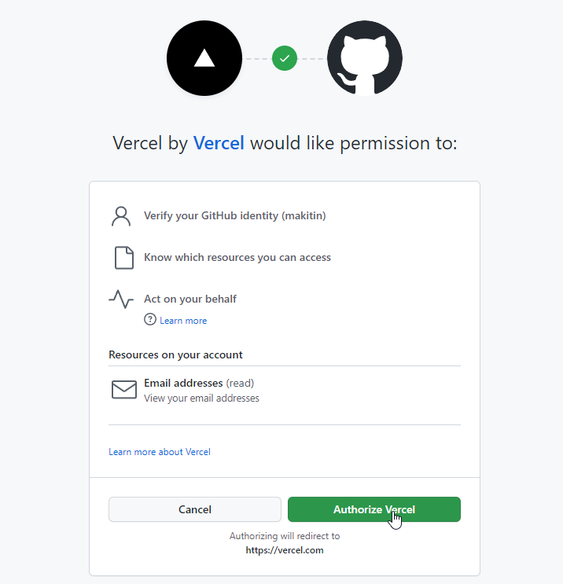
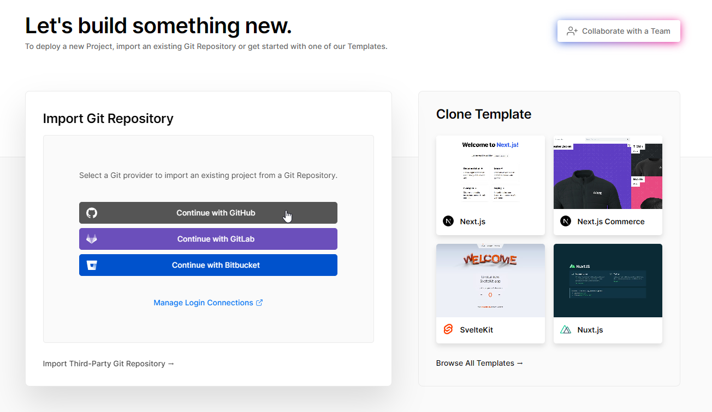
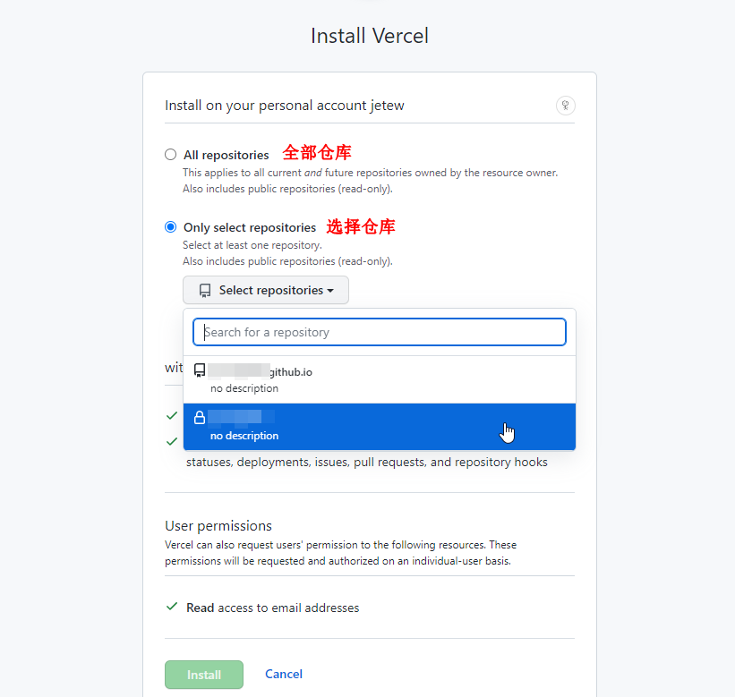
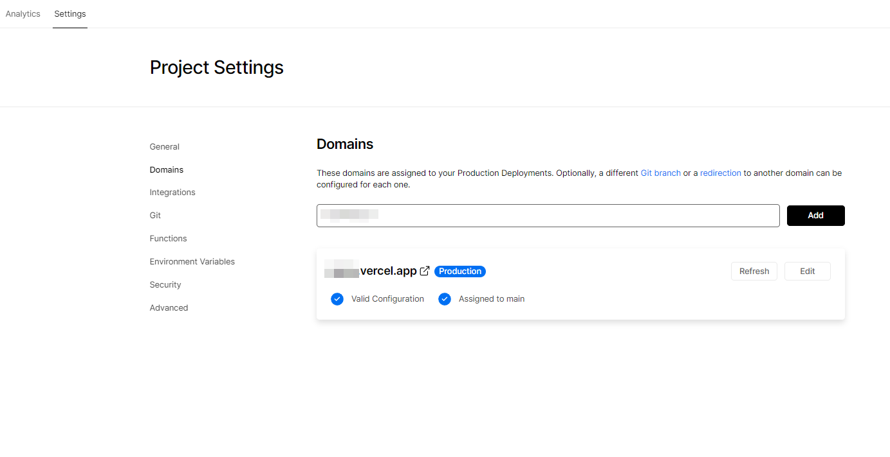

## 前言

之前在 [《使用 Github Actions 自动化部署 Hugo 博客》](/p/hugo-actions/) 一文中我讲了通过 Github Actions 自动部署 Hugo 博客到 Github Pages ； Github Pages 免费而且无需考虑成本及维护；但是 Github 毕竟是在海外，访问有问题，还时常抽风；访问体验算不上差强人意吧，也只能说是大失所望了。那怎样简单又低成本解决这个问题呢？ (毕竟白嫖才是硬道理) 现在就来看一下今天的主角：

- [Vercel 官网](https://vercel.com)

> Vercel 提供创新者在灵感瞬间创造所需的速度和可靠性 - 来自官方主页。

- [Netlify 官网](https://netlify.com)

> 用你喜欢的工具，轻松地在全球范围内自动化构建你的网站 - 来自官方主页。

<!--more-->

Vercel 和 Netlify 都属于页面托管服务，不需要进行复杂的配置；可以一键部署与构建你的网站。Vercel 和 Netlify 主要面向的是 Web 端的开发者，用于帮助他们快速搭建自己的 Web 端业务，可以完全实现前端业务的独立运维。它们都拥有以下优点：

- 免运维：不需要管理服务器主机或者服务器进程。
- 弹性伸缩：根据负载进行自动规模伸缩与自动配置。
- 按需付费：根据使用情况决定实际成本。
- 高可用：具备隐含的高可用性。

---

## 使用与部属

这里我以 Vercel 为例，因为他们两家操作都差不多，首先打开 Vercel 官网，点击右上角 **Sign Up - Continue with GitHub** 使用 Github 进行登陆：

之后让你进行授权，点击确认授权即可：

进入管理面板后，点击 **Create a New Project** 来创建新项目，然后选择 **Countinue with GitHub** 导入 Github 的仓库：

到这会让你选择仓库，你可以选择读取所有仓库，或者指定读取某一个仓库 (这里我就选择读取我 Hugo 博客的仓库) ，然后 Install：

之后会回到管理面板，点击 **Improt** 导入你刚才选择的仓库；然后就会进入部署配置页面，一般来讲是会自动识别你仓库的程序，然后自动选择好部署配置。如果没有的话可以自己设置；记得在环境变量添加一个 **HUGO_VERSION** 记录值为 Hugo 最新版本号，以防有的主题对版本有要求从而导致部署失败；设置完后就可以直接点击 **Deploy** 进行部署了：

等待部署，看到完结撒花就代表已经部署完成了：

然后点击 **Continue to Dashboard** 进入管理面板，再点击 **Settings - Domains** 为你的网站添加一个域名；输入你自己的域名后点击 **Add** 即可添加：

> 因为 Vercel 分配的二级域名是被 DNS 污染了的，所以通过二级 Vercel 分配的域名是访问不了的

在添加域名之后会提示你设置 **CNAME** 解析至 **cname.vercel-dns.com** ，这时候到你域名的管理商或者 DNS 提供商处添加 **CNAME** 解析即可：

设置完成后等待域名解析， Vercel 会自动添加 SSL 证书，并且设置 HTTPS 访问。

至于托管到 Netlify 的部署过程和 Vercel 是大同小异的，看你怎么选择，区别就只在于 Vercel 的二级域名不能进行访问，需要添加自己的域名而已。

---

## 总结

至此 Hugo 博客托管到 Vercel/Netlify 进行自动部署完成；通过测试，可以看到访问速度对比 Github Pages 还是拥有不小的提升的 (左边为 Vercel 右边为 Github Pages)：

在 Github 仓库导入到 Vercel/Netlify 之后，你每一次提交代码到 Hugo 博客仓库，这边都会自动进行部署及发布，相当于 Github Actions 自动部署并发布到 Github Pages 是一样的，不需要进行额外操作，非常方便。

## 参考资料

1. [Vercel 官网](https://vercel.com)
   
2. [Netlify 官网](https://netlify.com)
   
3. [Hugo 官方文档 - Host On Netlify](https://gohugo.io/hosting-and-deployment/hosting-on-netlify)
