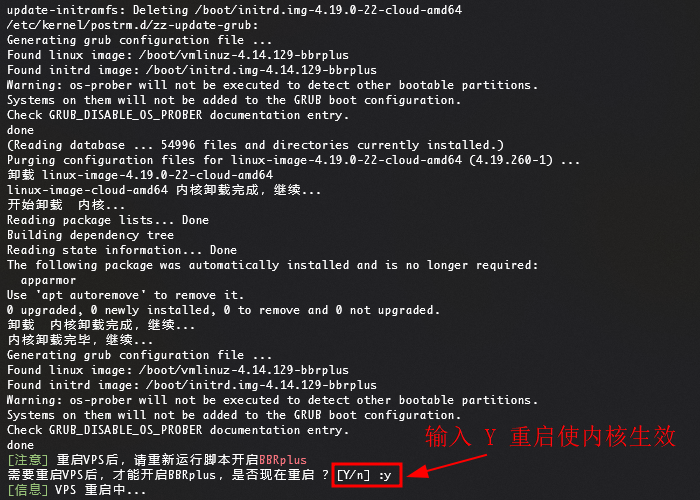
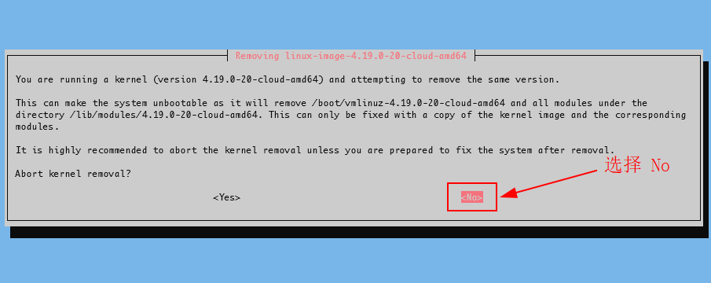

## 前言

由于最近在使用 VPS 时，发现 SSH 一直在被人暴力扫描，虽然说没有被破解，但是老是被人盯着总感觉不太舒服。其实要保证安全登录，最简单的方法就是修改默认的 22 端口；最彻底的方法，是禁用密码登录，改用密钥登录，只要保证密钥安全，服务器也没有人能进入了。而且现在手中的 VPS 越来越多，每次都要进行一些基本配置。所以对这些配置进行一下记录，方便以后查看。

<!--more-->

## 配置

### 修改登录密码

```bash
passwd
```

> 输入密码是不会显示的，按照提示输入新密码回车两次即可

---

### 更新、安装基本软件

```bash
apt update && apt dist-upgrade -y && apt autoremove -y && apt autoclean
apt install -y wget curl vim screen
```

---

### 修改SSH端口

```bash
vim /etc/ssh/sshd_config
```

> 这里我使用 vim 编辑，拿不准可以直接下载到本地编辑

找到默认 **22** 端口，将光标移动到该位置，输入 `i ` 进行编辑；去掉前面的注释，并且添加一个端口：

```bash
Port 22
Port 1234 # 以 1234 端口为例
```

编辑完成后按下 `ESC` 然后输入 `:wq` 保存退出，并重启 `ssh` 服务进程：

```bash
systemctl restart sshd
```

设置完毕后需要开放新端口，并开启防火墙；如果 VPS 管理面板自带防火墙可以通过管理面板开放端口；没有的话，我一般用 `ufw`：

```bash
apt install -y ufw
ufw allow 1234
ufw enable
```

> 开启防火墙后记得通过 `ufw allow xx` 开放常用端口

设置完成后，通过新端口进行 SSH 登录，测试是否成功，并且将默认的端口关闭：

```bash
vim /etc/ssh/sshd_config
```

将默认端口一行注释掉：

```bash
#Port 22
Port 1234
```

---

### 设置秘钥登录

修改端口虽然可以提升安全性，但是还是会被扫出端口，所以我们可以设置秘钥登录，并关闭密码登录。

- 通过命令行生成公钥与私钥

```bash
ssh-keygen -t rsa
```

提示如下：

```bash
Generating public/private rsa key pair.
Enter file in which to save the key (/root/.ssh/id_rsa): # 输入存储位置，建议回车使用默认位置
Enter passphrase (empty for no passphrase): # 输入密码(留空则直接回车)
Enter same passphrase again: # 重复输入密码
Your identification has been saved in /root/.ssh/id_rsa.
Your public key has been saved in /root/.ssh/id_rsa.pub. # 公钥与私钥存储位置
```

> 生成的秘钥文件位于 `~/.ssh` 目录下

也可以通过 `XShell` 或者 `PuTTy Gen` 软件进行生成秘钥文件，但是要注意它们生成的私钥并不通用，需要通过 `PuTTy Gen` 进行转换。

- 上传/配置公钥文件

如果是使用命令行在 VPS 生成的秘钥文件，则将私钥文件下载并导入 SSH 软件即可。若是软件生成，则将 `id_rsa.pub` 文件上传至 `~/.ssh` 目录下，完成上述操作后执行如下命令：

```bash
mv id_rsa.pub authorized_keys
chmod 600 authorized_keys
```

然后修改 `sshd_config` 找到并修改成下面个配置 ：

```bash
PubkeyAuthentication yes
```

保存退出，并重启服务进程：

```bash
systemctl restart sshd
```

使用 SSH 软件测试是否可以通过秘钥文件进行登录。

- 禁止密码登录

确认可以通过秘钥文件进行登录后，就可以禁止密码登录了，修改 `etc/ssh/sshd_config` 文件，找到并修改成如下：

```bash
PasswordAuthentication no
```

重启 `ssh` 

```bash
systemctl restart sshd
```

---

### 开启加速服务

复制下面命令，粘贴回车：

```bash
wget -N --no-check-certificate "https://raw.githubusercontent.com/chiakge/Linux-NetSpeed/master/tcp.sh"
chmod +x tcp.sh
./tcp.sh
```

面板如下：


操作方法：先安装内核，重启 VPS 让内核生效，再启动对应的加速即可。数字 1 的 BBR/BBR 魔改内核对应数字 4、5、6 的 BBR 加速、BBR 魔改加速和暴力 BBR 魔改版加速。数字 2 的 BBRplus 内核对应数字 7 的 BBRplus 加速。数字 3 的锐速加速内核对应数字 8 的锐速加速。


先安装内核，等待提示重启后输入 `y` 进行重启：



如果安装内核过程中，出现以下情况，选择否即可：



重启完成后，输入 `./tcp.sh` 进入加速面板，选择对应内核的加速并输入对应数字开启加速。看到提示加速成功后，再次输入 `./tcp.sh` 检查是否成功开启

如果想换一个加速，输入 `./tcp.sh` 进入面板，并输入数字9进行卸载加速，然后进行同样的操作，安装内核再安装对应内核的加速即可。

---

至此 VPS 的一些基本配置与优化结束

---