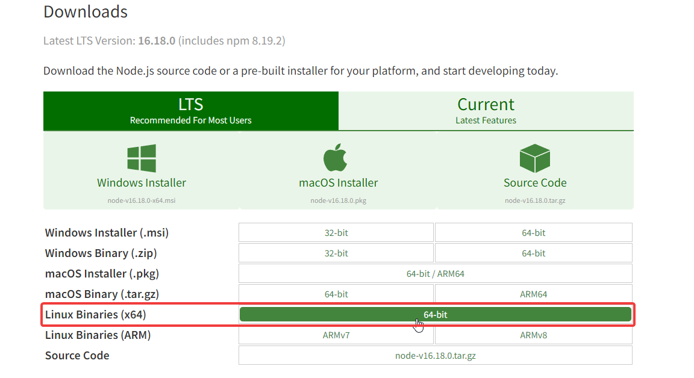

## 前言

之前讲了通过 Vercel 来进行 Waline 服务端的部署，这是最简单，也是完全免费的方法；但是对于拥有自己服务器的人来说，可能更想要将 Waline 直接部署到自己的服务器上；毕竟服务器摆在那，不用也是浪费，何不将 Waline 服务端也部署自己的服务器上以方便进行管理呢？其实 Waline 提供了很多的部署方案，可以看 [这里](https://waline.js.org/advanced/intro.html) ；因为我一直使用的 Caddy 所以我就用 Caddy+MariaDB/MySQL 的方式来搭建，这里记录一下踩坑过程；当然你使用 Nginx/Apache 加上其他数据库的组合也是可以的。

<!--more-->

## 部署过程

### 准备工作

域名解析这块就不多讲了，提前绑定到你的服务器 IP ；服务器基本配置与优化可以参考 [这里](/archives/setvps) ；至于 Web 服务这块，如果你使用 Nginx/Apache+MariaDB/MySQL 可以看 [这里](/archives/oneinstack) 搭建好 Web 服务与数据库。

如果你想和我一样使用 Caddy Server 那么你可以参考 [这里](/archives/caddy) 先搭建 Caddy Server ；然后来安装数据库，我这里以 MariaDB/MySQL 为例：

```bash
apt update
apt install mariadb-server -y
```

安装完 MariaDB 后，键入以下命令来进行初始化：

```bash
mysql_secure_installation
```

然后根据下面提示进行操作：

```bash
mysql_secure_installation

Enter current password for root (enter for none): # 输入数据库密码，由于并未设置，所以直接回车

Set root password? [Y/n] y # 是否设置数据库 root 密码
New password:
Re-enter new password: # 输入两次数据库 root 密码

Remove anonymous users? [Y/n] y # 是否移除匿名用户

Disallow root login remotely? [Y/n] y # 是否禁用 root 远程登陆

Remove test database and access to it? [Y/n] y # 是否移除测试数据库

Reload privilege tables now? [Y/n] y # 是否初始化数据库

All done!  If you've completed all of the above steps, your MariaDB
installation should now be secure.

Thanks for using MariaDB!
```

如果你需要用软件进行远程管理数据库，那么就不要禁用远程登陆，并且需要通过防火墙来开放 `3306` 端口

---

### 安装 Nodejs

这里要注意，不要直接使用 `apt install` 进行安装，会导致后面报错，具体原因我也不知道。所以我们可以通过包管理器、二进制文件或者源码编译进行安装。

#### 包管理器安装

输入以下命令进行安装：

```bash
apt-get update
apt-get install -y ca-certificates curl gnupg
mkdir -p /etc/apt/keyrings
curl -fsSL https://deb.nodesource.com/gpgkey/nodesource-repo.gpg.key | gpg --dearmor -o /etc/apt/keyrings/nodesource.gpg
NODE_MAJOR=16
echo "deb [signed-by=/etc/apt/keyrings/nodesource.gpg] https://deb.nodesource.com/node_$NODE_MAJOR.x nodistro main" | tee /etc/apt/sources.list.d/nodesource.list
apt-get update
apt-get install nodejs -y
```

其中 `NODE_MAJOR=16` 可以自行选择版本：

```bash
NODE_MAJOR=16
NODE_MAJOR=18
NODE_MAJOR=20
NODE_MAJOR=21
```

安装完成后可通过 `node-v` 、`nmp version`、`npx -v` 检验安装

卸载：

```bash
apt-get purge nodejs &&\
rm -r /etc/apt/sources.list.d/nodesource.list &&\
rm -r /etc/apt/keyrings/nodesource.gpg
```

#### 二进制安装

从 [Nodejs官网](https://nodejs.org/) 下载二进制包，通过创建软链接至系统用户应用程序目录来使用。

打开 Nodejs 官网，点击 Downloads 然后右键复制 Linux Binaries (x64) 的下载链接：



然后回到 SSH 软件，使用 `wget` 命令，下载到任意位置并进行解压然后删除压缩包；我这里以 **/usr/local/src** 为例：

```bash
cd /usr/local/src # 进入目录
wget https://nodejs.org/dist/v16.18.0/node-v16.18.0-linux-x64.tar.xz # 下载二进制包
tar -Jxvf node-v16.18.0-linux-x64.tar.xz # 解压
mv node-v16.18.0-linux-x64 node # 重命名文件夹
```

编辑 `~/.bashrc` 设置环境变量，加入：

```bash
# Nodejs
DISTRO=linux-x64
export PATH=/usr/local/src/node/bin:$PATH
```

刷新变量环境：

```bash
source ~/.bashrc
```

完成后可通过 `node -v` 、 `npm version` 、 `npx -v` 进行验证，返回版本号则表示成功。

#### 源码编译安装

首先安装依赖：

```bash
apt-get install python3 g++ make python3-pip
```

打开 [Nodejs官网](https://nodejs.org/) ，复制 `Source Code` 源码下载地址，接着进行操作：

```bash
cd /usr/local/src
wget https://nodejs.org/dist/v20.10.0/node-v20.10.0.tar.gz
tar zxvf node-v20.10.0.tar.gz
mv node-v20.10.0 node
cd node
./configure --prefix=/usr/local/node
screen -S node
make && make install
```

安装完成之后为软件设置环境变量：

```bash
vim ~/.bashrc
```

在最后添加：

```bash
# Nodejs
DISTRO=linux-x64
export PATH=/usr/local/node/bin:$PATH
```

可以为软件设置个软链接：

```bash
ln -s /usr/local/node/bin/node /usr/bin/node
ln -s /usr/local/node/bin/npm /usr/bin/npm
ln -s /usr/local/node/bin/npx /usr/bin/npx
```

刷新变量环境：

```bash
source ~/.bashrc
```

源码编译安装比较费时，具体时间视机器配置而定，可酌情选择安装方式。

---

### 安装 Waline 

按照官方给出的独立部署中直接运行的方案，进入你想要安装的位置，安装好模块后直接运行模块内的 vanilla.js 文件：

```bash
cd /usr/local/node/lib
npm install -g @waline/vercel
```

国内服务器请先将 **npm** 设置为国内镜像！！！

#### 更换镜像

1. 临时更换

```bash
npm --registry https://registry.npmmirror.com install -g @waline/vercel
```

2. 永久更换

```bash
npm config set registry https://registry.npmmirror.com
```

3. 还原 npm 镜像

```bash
npm config set registry https://registry.npmjs.org/
```

下载完成后，可以试着运行一下：

```bash
node node_modules/@waline/vercel/vanilla.js
```

成功的话可以看到提示：


此时你可以通过 **IP:8360** 进行访问；不要着急，按捺下你的小激动，按下 <kbd><kbd>CTRL</kbd>+<kbd>C</kbd></kbd> 关闭，然后跟着我继续进行配置。

---

### 配置数据库

到官方文档的 [多数据库服务支持](https://waline.js.org/guide/server/databases.html) 下载我们对应数据库的数据文件，我这里用的 MariaDB(MySQL) 所以下载 [waline.sql](https://github.com/walinejs/waline/blob/main/assets/waline.sql) 然后进行导入数据：

> **注意**：将源代码直接复制然后自己进行编辑上传，不要直接使用 `wget` 进行下载。

```bash
mysql -uroot -p # 登陆数据库
Enter password: # 输入密码
CREATE DATABASE waline; # 创建 waline 数据库
USE waline; # 指定数据库
source /path/waline.sql # 导入文件，/path改为你的路径
quit # 退出数据库
```

创建用户名，密码并赋予 waline 数据库的权限(可选)

```bash
mysql -uroot -p
Enter password:
CREATE USER 'waline'@'%' IDENTIFIED BY '密码';
GRANT ALL PRIVILEGES ON waline.* TO 'waline'@'%';
flush privileges;
quit
```

---

### 配置 systemd 服务

为了方便 Waline 的正常运行与管理，我使用的是 systemd 服务进行管理，创建文件并进行编辑(拿不准的可以在本地新建文件，编辑之后上传)：

```bash
cd /usr/lib/systemd/system/
vim waline.service
```

模板如下：

```service
[Unit]
Description=Waline

[Service]
Type=simple
ExecStart=[/path/to/node] [path/to/node_modules]/@waline/vercel/vanilla.js
Restart=always
Environment=PATH=/usr/bin:/usr/local/bin
Environment=NODE_ENV=production
Environment=MYSQL_DB=数据库名
Environment=MYSQL_USER=用户名
Environment=MYSQL_PASSWORD=密码
WorkingDirectory=[/path/to/node_modules]/@waline/vercel

[Install]
WantedBy=multi-user.target
```

其中，占位符内容如下：

```
[/path/to/node]：node 可执行文件绝对路径
[path/to/node_modules]：通过 npm 安装模块位置
```

我的配置如下：

```service
[Unit]
Description=Waline

[Service]
Type=simple
ExecStart=/usr/bin/node /usr/local/node/lib/node_modules/@waline/vercel/vanilla.js
Restart=always
Environment=PATH=/usr/bin:/usr/local/bin
Environment=NODE_ENV=production
Environment=MYSQL_DB=数据库名
Environment=MYSQL_USER=用户名
Environment=MYSQL_PASSWORD=密码
WorkingDirectory=/usr/local/node/lib/node_modules//@waline/vercel

[Install]
WantedBy=multi-user.target
```

如果你之前按照我的步骤来安装 **Node** 和 **Waline** 那么直接将脚本复制然后修改参数即可，如果你的位置和我不一样，那么就需要将 **ExecStart** 和 **WorkingDirectory** 项中的路径换成你自己的。不确定可以使用命令查一下：

```bash
where is node # node 位置
npm root -g # npm 全局安装位置
```

在 `[Service]` 项中，你可以通过 `Environment` 直接添加 Waline 插件的环境变量

保存/上传完毕后，让 systemd 重新载入单元文件，并启动 Waline ：

```bash
systemctl daemon-reload
systemctl start waline
```

此时再访问 http://IP:8360 ，你就能看到评论页面了。

一些常用的命令：

```bash
systemctl stop waline  # 停止服务
systemctl restart waline # 重启服务
systemctl status waline # 服务状态
systemctl enable waline # 添加开机自启动
```

---

### 反向代理设置

如果你不想通过 IP:8360 进行访问，那么就需要设置反向代理来通过域名进行访问了这里提供两个配置：

#### Caddy 

我使用的是 Caddy ， Caddy 反代需要修改 **/etc/caddy/Caddyfile** 文件：

```caddyfile
domain.com {
    encode gzip
    reverse_proxy 127.0.0.1:8360 {
      header_up Host {host}
		  header_up X-Real-IP {remote}
		  header_up X-Forwarded-For {remote}
		  header_up X-Forwarded-Proto https
    }
    file_server
    tls user@email.com
}
```

#### Nginx

Nginx 反向代理如下：

```nginx
location / {
    proxy_pass http://127.0.0.1:8360;
    proxy_set_header Host $host;
    proxy_set_header X-Real-IP $remote_addr;
    proxy_set_header X-Forwarded-For $proxy_add_x_forwarded_for;
    proxy_set_header X-Forwarded-Proto $scheme;
    proxy_set_header REMOTE-HOST $remote_addr;
    add_header X-Cache $upstream_cache_status;
    # cache
    add_header Cache-Control no-cache;
    expires 12h;
  }
```

---

## 总结

以上就是我通过 Caddy+MariaDB 独立部署 Waline 的过程，希望能给大家带来帮助。后期如果需要设置邮件通知等功能可以在 waline.service 文件中的 **[Service]** 项下直接添加 Environment= 然后根据官方给出的环境变量进行设置即可。

若 Waline 后台发现有更新提示，可通过 `npm` 对 Waline 进行更新：

```bash
npm update @waline/vercel
```

### 参考资料

1. [Waline 官方文档](https://waline.js.org)
   
2. [NodeSource - Node.js 官方二进制发行版](https://github.com/nodesource/distributions/blob/master/README.md)
   
3. [通过二进制文件安装 Node.js](https://github.com/nodejs/help/wiki/Installation)

4. [Node 应用的 Systemd 启动](https://www.ruanyifeng.com/blog/2016/03/node-systemd-tutorial.html)
